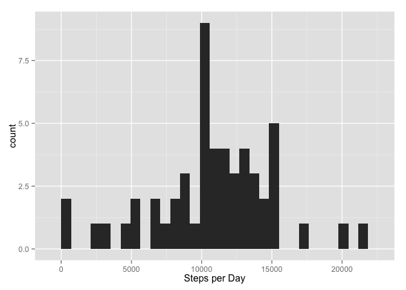
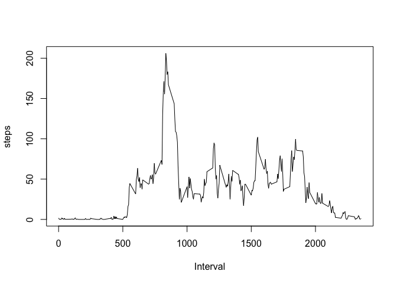
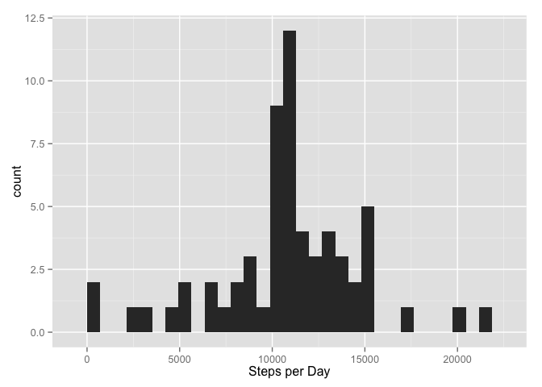

# Reproducible Research: Peer Assessment 1


## Loading and preprocessing the data
This is the report for Reproducible Research Peer Assessment 1.  In this report we present data from a fitness tracking device.

The first step is to load and format the data:


```r
fit <- read.csv("activity.csv")
head(fit)
```

```
##   steps       date interval
## 1    NA 2012-10-01        0
## 2    NA 2012-10-01        5
## 3    NA 2012-10-01       10
## 4    NA 2012-10-01       15
## 5    NA 2012-10-01       20
## 6    NA 2012-10-01       25
```

```r
fitclean <- fit
fitclean$date <- as.Date(fitclean$date)
```


## What is mean total number of steps taken per day?

A histogram of the number of steps taken per day is shown below:


```r
library(ggplot2)
stepsPerDay <- tapply(fitclean$steps,as.factor(fitclean$date),sum)
head(stepsPerDay)
```

```
## 2012-10-01 2012-10-02 2012-10-03 2012-10-04 2012-10-05 2012-10-06 
##         NA        126      11352      12116      13294      15420
```

```r
qplot(stepsPerDay, xlab = "Steps per Day")
```

```
## stat_bin: binwidth defaulted to range/30. Use 'binwidth = x' to adjust this.
```

 

The mean and median of the steps taken per day are shown below:


```r
summary(stepsPerDay)
```

```
##    Min. 1st Qu.  Median    Mean 3rd Qu.    Max.    NA's 
##      41    8841   10760   10770   13290   21190       8
```


## What is the average daily activity pattern?

Next we show the average number of steps taken per five minute interval on a daily basis, averaged across all days:


```r
dailyInterval <- tapply(fitclean$steps,as.factor(fitclean$interval),mean, na.rm = TRUE)
head(dailyInterval)
```

```
##         0         5        10        15        20        25 
## 1.7169811 0.3396226 0.1320755 0.1509434 0.0754717 2.0943396
```

```r
plot(names(dailyInterval),dailyInterval, xlab = "Interval", ylab = "steps", type = "l")
```

 


```r
maxSteps <- max(dailyInterval)
maxInterval <- subset(dailyInterval,dailyInterval==max(dailyInterval))
```

On average, the maximum number of steps taken per day in a five minute interval is 206.1698113.  This five minute interval is 206.1698113.

## Imputing missing values


```r
missing <- sum(is.na(fitclean$steps))
```

We notice that in the original data set, there are 2304 missing values.  We can impute the missing values by replacing them with the average number of steps across all days in the data set for that five minute interval, which we calculated to produce the previous plot.


```r
# Impute missing values based on average 5-minute interval value
fitmiss <- fitclean
for (n in row(fitmiss)) {
    if (is.na(fitmiss$steps[n])) {
        intName <- as.character(names(dailyInterval))
        missInt <- as.character(fitmiss$interval[n])
        replace <- dailyInterval[intName==missInt]
        fitmiss$steps[n] <- replace
    }
}
```

Here is a histogram of the data after missing values have been imputed:


```r
head(fitmiss)
```

```
##       steps       date interval
## 1 1.7169811 2012-10-01        0
## 2 0.3396226 2012-10-01        5
## 3 0.1320755 2012-10-01       10
## 4 0.1509434 2012-10-01       15
## 5 0.0754717 2012-10-01       20
## 6 2.0943396 2012-10-01       25
```

```r
stepsFillPerDay <- tapply(fitmiss$steps,as.factor(fitmiss$date),sum)
qplot(stepsFillPerDay, xlab = "Steps per Day")
```

```
## stat_bin: binwidth defaulted to range/30. Use 'binwidth = x' to adjust this.
```

 

The mean and median of the steps taken per day after missing values have been imputed are shown below:


```r
summary(stepsFillPerDay)
```

```
##    Min. 1st Qu.  Median    Mean 3rd Qu.    Max. 
##      41    9819   10770   10770   12810   21190
```

## Are there differences in activity patterns between weekdays and weekends?

Finally we examine the differences in activity patterns between weekdays and weekends.  We do this by creating a new factor variable with the R "weekdays()" function:


```r
fitmiss$weekdays <- weekdays(fitmiss$date)
head(fitmiss)
```

```
##       steps       date interval weekdays
## 1 1.7169811 2012-10-01        0   Monday
## 2 0.3396226 2012-10-01        5   Monday
## 3 0.1320755 2012-10-01       10   Monday
## 4 0.1509434 2012-10-01       15   Monday
## 5 0.0754717 2012-10-01       20   Monday
## 6 2.0943396 2012-10-01       25   Monday
```

```r
fitmiss$weekdays[fitmiss$weekdays=="Monday"] <- "weekday"
fitmiss$weekdays[fitmiss$weekdays=="Tuesday"] <- "weekday"
fitmiss$weekdays[fitmiss$weekdays=="Wednesday"] <- "weekday"
fitmiss$weekdays[fitmiss$weekdays=="Thursday"] <- "weekday"
fitmiss$weekdays[fitmiss$weekdays=="Friday"] <- "weekday"
fitmiss$weekdays[fitmiss$weekdays=="Saturday"] <- "weekend"
fitmiss$weekdays[fitmiss$weekdays=="Sunday"] <- "weekend"
d <- with(fitmiss,tapply(steps,list(as.factor(interval),weekdays),mean))
# reshape "d" with both columns concatenated and with a second
# factor column indicating weekday or weekend
head(d)
```

```
##       weekday     weekend
## 0  2.25115304 0.214622642
## 5  0.44528302 0.042452830
## 10 0.17316562 0.016509434
## 15 0.19790356 0.018867925
## 20 0.09895178 0.009433962
## 25 1.59035639 3.511792453
```

```r
mtwrf <- d[,1]
satsun <- d[,2]
```

